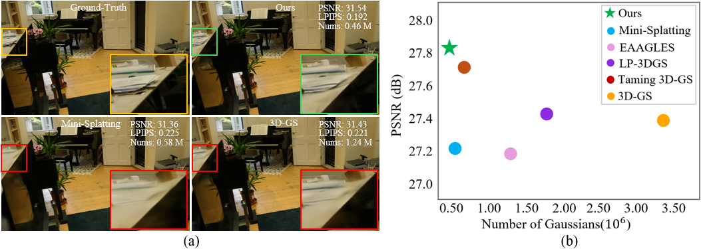
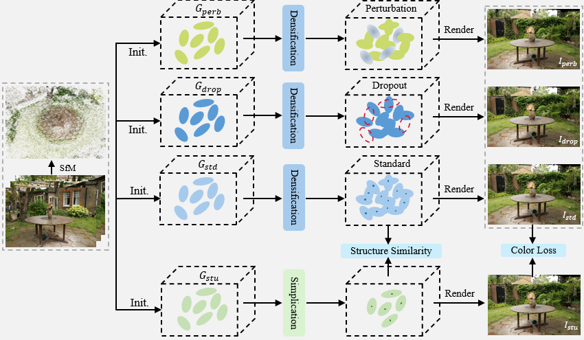

<h2 align="center" width="100%">
Distilled-3DGS: Distilled 3D Gaussian Splatting
</h2>
<div>
<div align="center">
    <a href='https://distilled3dgs.github.io/' target='_blank'>Lintao Xiang</a><sup>*1</sup>&emsp;
    <a href='https://distilled3dgs.github.io/' target='_blank'>Xinkai Chen</a><sup>*2</sup>&emsp;
    <a href='https://cse.sysu.edu.cn/teacher/LaiJianhuang' target='_blank'>Jianhuang Lai</a><sup>3</sup>&emsp;
    <a href='https://wanggcong.github.io/' target='_blank'>Guangcong Wang</a><sup>2</sup><br>
</div>
<div>
<div align="center">
    <sup>1</sup>The University of Manchester&emsp;
    <sup>2</sup>Vision, Graphics, and X Group, Great Bay University<br>
    <sup>3</sup>Sun Yat-Sen University
</div>

<p align="center">
  <a href="https://arxiv.org/abs/2508.14037" target='_blank'>
    
  </a>
  <a href="https://distilled3dgs.github.io/" target='_blank'>
    
  </a>
</p>

<div style="text-align:center">

</div>

>**TL;DR**: <em>We present Distilled-3DGS, a simple yet effective knowledge distillation framework that achieves competitive performance in both rendering quality and storage efficiency.</em>

## ⚡ Updates
+ [2025.08.19] **[Project Page](https://distilled3dgs.github.io/)** |  **[arXiv](https://arxiv.org/abs/2508.14037)** released.


## 🌟 Abstract
3D Gaussian Splatting (3DGS) has exhibited remarkable efficacy in novel view synthesis (NVS). However, it suffers from a significant drawback: achieving high-fidelity rendering typically necessitates a large number of 3D Gaussians, resulting in substantial memory consumption and storage requirements. To address this challenge, we propose the first knowledge distillation framework for 3DGS, featuring various teacher models, including vanilla 3DGS, noise-augmented variants, and dropout-regularized versions.  The outputs of these teachers are aggregated to guide the optimization of a lightweight student model. To distill the hidden geometric structure, we propose a structural similarity loss to boost the consistency of spatial geometric distributions between the student and teacher model. Through comprehensive quantitative and qualitative evaluations across diverse datasets, the proposed Distilled-3DGS—a simple yet effective framework without bells and whistles—achieves promising rendering results in both rendering quality and storage efficiency compared to state-of-the-art methods. 

## 🌟 Pipeline
<div style="text-align:center">

</div>
Our method consists of two stages. First, a standard teacher model G_std is trained, along with two variants: G_perb with random perturbation and G_drop with random dropout. Then, a pruned student model G_std is supervised by the outputs of these teachers. Additionally, a spatial distribution distillation strategy is introduced to help the student learn structural patterns from the teachers.

## 1. Setup
This code has been tested with Python 3.10, torch 2.0.1, CUDA 11.8

- Clone the repository

  ```
git clone https://github.com/lt-xiang/Distilled-3DGS.git && cd Distilled-3DGS
  ```

- Setup python environment

```
conda create -n DistilledGS python=3.10
conda activate DistilledGS
pip install torch==2.0.1 torchvision==0.15.2 torchaudio==2.0.2 --index-url https://download.pytorch.org/whl/cu118
pip install -r requirements.txt
```
## 2. Dataset

(1) Download dataset: [Mip-NeRF 360](https://jonbarron.info/mipnerf360/), [T&T+DB COLMAP](https://repo-sam.inria.fr/fungraph/3d-gaussian-splatting/datasets/input/tandt_db.zip).

(2)  Generate depth maps

 a. Clone Depth Anything v2:

```
git clone https://github.com/DepthAnything/Depth-Anything-V2.git
```

 b. Download weights from [Depth-Anything-V2-Large]:(https://huggingface.co/depth-anything/Depth-Anything-V2-Large/resolve/main/depth_anything_v2_vitl.pth?download=true) and place it under `Depth-Anything-V2/checkpoints/`

 c. Generate depth maps:
```
python Depth-Anything-V2/run.py --encoder vitl --pred-only --grayscale --img-path <path to input images> --outdir <output path>
```
 d. Generate a `depth_params.json` file using:
```
python utils/make_depth_scale.py --base_dir <path to colmap> --depths_dir <path to generated depths>
```
## 3. Model

Run following scripts for model training and evaluation

Train with train/test split:

```
#mipnerf360 indoor
run_mip360_in.sh
#mipnerf360 indoor
run_mip360_out.sh
#t&t
run_db.sh
#db
run_tnt.sh
```

Take *bonsai* scene from Mip360 as  an example,  we firslty train three different teacher models, then outputs from these teacher models are used to supervise the training of student model.

```
#1.model training
python train.py \
--source_path <dataset path> \
--model_path <model path> \
--resolution 2 \
--eval \
--imp_metric indoor \
--iterations 30000 \
--num_models 4  #0,1,2 are teacher models, 3 is student model.

#2. model inference for student model
python render.py \
--source_path <dataset path> \
--model_path <model path> \
--skip_train \
--iteration 30000 \
--itrain 3 #student model

#3.Evaluation
python metrics.py --model_path <model path>
```

## Acknowledgement

Special thanks to the following awesome projects!
- [Gaussian-Splatting](https://github.com/graphdeco-inria/gaussian-splatting)
- [Mini-Splatting](https://github.com/fatPeter/mini-splatting)
- [Dropout-Gaussian](https://github.com/DCVL-3D/DropGaussian_release)


<div class="container is-max-desktop content">
  <h2 class="title">Citation</h2>
  <pre><code>@article{Xiang2025Distilled3DGaussianSplatting,
title={Distilled-3DGS: Distilled 3D Gaussian Splatting},
author={Lintao Xiang and Xinkai Chen and Jianhuang Lai and Guangcong Wang},
journal={arxiv},
year={2025}}</code></pre>
</div>
